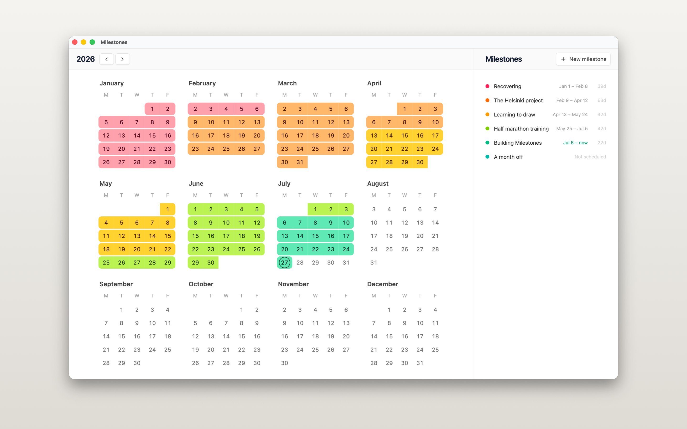

# Milestones

A local-first app for seeing the shape of a year. The left pane is a full
calendar of every month; the right pane is a sortable list of milestones. Say
when a milestone started and it paints its color across the calendar, up to
today or up to the day it finished.

The milestones are a single timeline — no two of them cover the same day. Set
one to start today and whatever was running finishes yesterday.



## Using it

Right-click a milestone for everything it can do:

| Menu item           | What it does                                           |
| ------------------- | ------------------------------------------------------ |
| Start today         | Begins it today, finishing whatever was running        |
| Finish today        | Ends it today, so the calendar stops there             |
| Mark as in progress | Drops the finish date; it runs to today again          |
| Start on day…       | Turns the calendar into a date picker                  |
| Finish on day…      | The same, for the other end                            |
| Clear dates         | Keeps the milestone, gives up its stretch of calendar  |
| Color               | Any of ten; a new milestone takes the first unused one |

Keys: `↑`/`↓` move the selection, `Enter` renames, `Delete` removes, `⌘N`
adds, `⌘Z` / `⇧⌘Z` undo and redo, `Esc` cancels a date pick.

Drag rows to reorder the list. That order is yours to arrange — it has
nothing to do with the dates.

Everything is stored in `milestones.json` in the app's data directory. The
file is the document — copy it and you have copied your year. There is no
server.

## Development

A macOS desktop app: Tauri v2 around React 19, Vite, TypeScript and
Tailwind v4. There is no browser build — the app wants a window, a menu bar
and a filesystem, so `npm run dev` alone will not get you far.

```sh
npm install
npm run tauri dev
```

`npm run build`, `npm run lint`, and `npm run format` do what they say. See
`AGENTS.md` for how the code is organised.

The Mac App Store build is a different animal — universal, sandboxed and
signed — and `scripts/build-mas.sh` builds it. `PRIVACY.md` is the privacy
policy the listing points at; it is short, because there is nothing to say.
